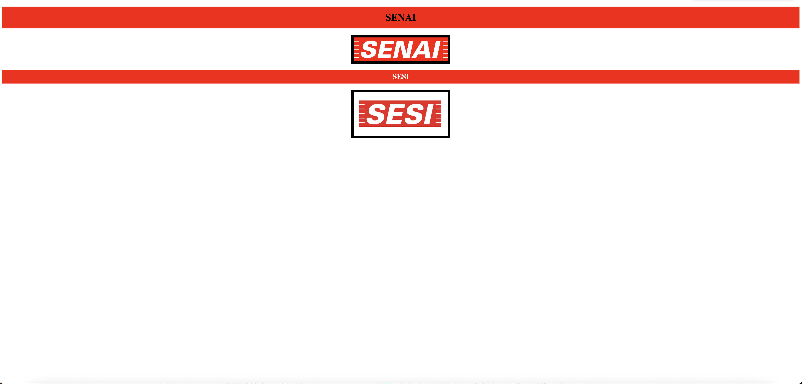

# Landing page - Estruturas básicas

---

## Sobre
Site do tipo landing page para trabalhar com as estruturas básicas das linguagens. O objetivo deste projeto é colocar em prática os conhecimentos adquiridos sobre linguagem de marcação, durante o curso de desenvolvimento de sistemas [SENAI jandira](https://sp.senai.br/unidade/jandira/)

---

## Tecnologias utilizadas
- HTML
- CSS
- Markdown
- Git

---

## Autor 
- [Hugo Lopes](https://www.linkedin.com/in/hugo-lopes-souza-a25b9122a/)
